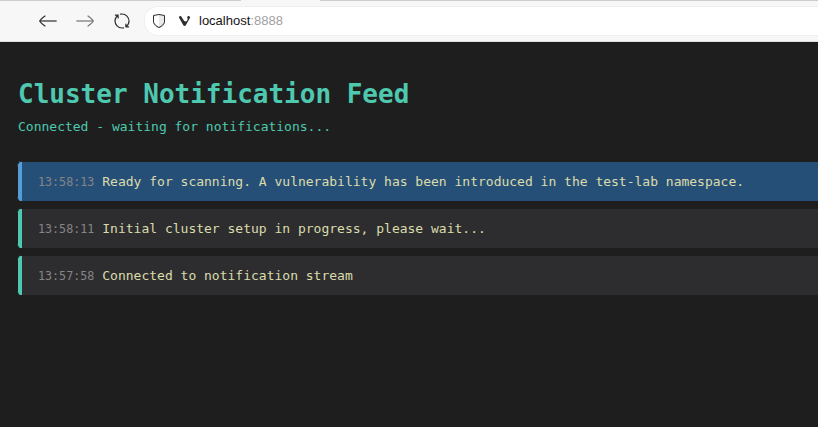

# vulnerable-k8s-operator

Sometimes, it's helpful to practice identifying security vulnerabilities in a running k8s cluster that's not production. So this is a very simple k8s operator that picks a random vulnerability from the [OWASP Kubernetes Top Ten](https://owasp.org/www-project-kubernetes-top-ten/) and configures a k3s cluster with that misconfiguration.

## Owasp categories

Implemented in this version:

- [K01: Insecure Workload Configurations](https://owasp.org/www-project-kubernetes-top-ten/2022/en/src/K01-insecure-workload-configurations)

- [K03: Overly Permissive RBAC Configurations](https://owasp.org/www-project-kubernetes-top-ten/2022/en/src/K03-overly-permissive-rbac)

- [K07: Missing Network Segmentation Controls](https://owasp.org/www-project-kubernetes-top-ten/2022/en/src/K07-network-segmentation)

- [K08: Secrets Management Failures](https://owasp.org/www-project-kubernetes-top-ten/2022/en/src/K08-secrets-management)


Not implemented in this version (documented here for completeness):

- [K02: Supply Chain Vulnerabilities](https://owasp.org/www-project-kubernetes-top-ten/2022/en/src/K02-supply-chain-vulnerabilities) (not implemented; would require image scanning tooling)

- [K04: Lack of Centralized Policy Enforcement](https://owasp.org/www-project-kubernetes-top-ten/2022/en/src/K04-policy-enforcement) (not implemented; depends on external policy infra)

- [K05: Inadequate Logging and Monitoring](https://owasp.org/www-project-kubernetes-top-ten/2022/en/src/K05-inadequate-logging) (not implemented; depends on external logging)

- [K06: Broken Authentication Mechanisms](https://owasp.org/www-project-kubernetes-top-ten/2022/en/src/K06-broken-authentication) (not implemented in current operator logic)

- [K09: Misconfigured Cluster Components](https://owasp.org/www-project-kubernetes-top-ten/2022/en/src/K09-misconfigured-cluster-components) (not implemented; cluster-level admin required)

- [K10: Outdated and Vulnerable Kubernetes Components](https://owasp.org/www-project-kubernetes-top-ten/2022/en/src/K10-vulnerable-components) (not implemented; cluster-level admin required)

The first thing to do is run some scanners to see what you can pick up (or you can eyeball the cluster/spec/etc, but the scanners are probably what you'll be using in production automation).

- [kubescape](https://kubescape.io/docs/install-cli/) (this should pick up all the issues in the  K01, K03, K07, K08 categories but might not pick up things from other OWASP categories)

### scanning commands

Find the vulnerabilities by running one of the following scans:

- scan the entire namespace with kubescape
```sh
$ kubescape scan --include-namespaces test-lab
```

- scan a specific deployment in the namespace with kubescape
```sh
$ kubescape scan workload Deployment/<deployment-name> --include namespaces test-lab
```

- scan with kubescape using one of the built-in frameworks (nsa/mitre)
```sh
$ kubescape scan framework mitre --include-namespaces test-lab
```

## Sub-categories (Implemented)

Each implemented vulnerability category has sub-issues that are randomly selected:

- K01 (Insecure Workload Configurations) - 5 sub-issues:

  1. Privileged container - Sets privileged: true (Kubescape C-0057)
  2. Running as root - Sets runAsUser: 0 (Kubescape C-0013)
  3. Host PID/IPC access - Sets hostPID: true and hostIPC: true (Kubescape C-0038)
  4. HostNetwork access - Sets hostNetwork: true (Kubescape C-0041)
  5. HostPath volume mount - Mounts host /var/log via hostPath volume (Kubescape C-0048)

- K03 (Overly Permissive RBAC) - 5 sub-issues:

  1. Secrets access role/binding - Grants list/get/watch on secrets in namespace (Kubescape C-0015)
  2. Pod creation role/binding - Grants create/list/watch on pods (Kubescape C-0188)
  3. Delete capabilities role/binding - Grants delete on core resources (Kubescape C-0007)
  4. Portforward role/binding - Grants pods/portforward (Kubescape C-0063)
  5. Exec role/binding - Grants pods/exec (Kubescape C-0002)

- K07 (Missing Network Segmentation) - 1 sub-issue:

  1. Backend microservice exposed - Removes user-service network policy (Kubescape C-0260)

- K08 (Secrets Management Failures) - 1 sub-issue:

  1. Secret data in ConfigMaps - Stores sensitive data in ConfigMap instead of Secret (Kubescape C-0012)


## Description

The operator is geared toward two distinct, though related, use cases.

1. Running it in [Iximiuz Labs](https://labs.iximiuz.com) as a learning resource for users wanting practice finding and remediating kubernetes vulnerabilities like this.

2. Running it in a remote ephemeral namespace for teams to test out their security scanning (I have no idea if anybody actually wants to do this, but I tried to make it as easy as possible)

For the first case, we're running the compiled binary on the VM, which is not at all how you would normally deploy an operator in a production context, but it gives us a few advantages.

- We don't want the operator itself to get flagged by the scans, and this way it doesn't actually run in the cluster, so it won't interfere with the investigation of the learners..
- This is a completely ephemeral environment of a single node k3s cluster, and it's much easier and quicker than needing to deal with a container registry.
- The logs of what the configured vulnerability is are harder for the learner to find, and so less of a temptation to "cheat" (though they could still be found, they're just not findable via a `kubectl logs` command).

## Sequence of events in the labs

The custom playground will start the cluster and install the CRD. It will start the operator and notify the user via a notifications tab available on localhost:8888 every time the operator changes state. The user can continue finding and fixing the vulnerabilities as long as they want.

### Cluster Notifications



The operator provides real-time feedback about cluster status directly through SSE notifications available in a browser tab on localhost:8888. Notifications are sent directly to the broswer by the operator itself, and there's logic to send a pop-up notification if the tab isn't in focus.

You'll see notification messages when:
- Initial cluster setup begins
- The cluster is ready for scanning
- A change is detected but the vulnerability persists
- A vulnerability is successfully remediated
- The cluster is being reset for the next challenge

No additional setup is required - just run the operator and notifications will appear in the notifications browser tab.

## Getting Started

### Quick Start (Local)

If you already have a local k3s cluster running, the easiest path is a single command:

```sh
./scripts/lab.sh up
```

What this does:
- Cleans up any previous lab state.
- Installs/refreshes the CRD.
- Seeds a default `VulnerableLab` resource.
- Runs the operator in the foreground so you can see logs and notifications.

### macOS (brief)

Use a local Kubernetes distribution that provides a kubeconfig:
- Option 1: `colima start --kubernetes`
- Option 2: Docker Desktop with Kubernetes enabled

Then make sure `kubectl config current-context` points to that cluster, and run:

```sh
./scripts/lab.sh up
```

### Vulnerability Selection and Persistence Behavior

The operator provides three different behaviors depending on how you specify the vulnerability:

1. **Complete randomization**: New category AND new sub-issue after each remediation
2. **Category persistence**: Same category, new random sub-issue after each remediation
3. **Complete persistence**: Same category AND same sub-issue after each remediation

This persistence behavior allows you to:
- Practice identifying different vulnerability types (option 1)
- Focus on a specific vulnerability category while exploring its variants (option 2)
- Repeatedly practice the exact same vulnerability for mastery (option 3)

### Examples of creating a new CRD with varying levels of randomness

**Complete random selection** (new category + new sub-issue after each remediation cycle):

```sh
kubectl apply -f - <<EOF
apiVersion: lab.security.lab/v1alpha1
kind: VulnerableLab
metadata:
  name: test-lab
spec:
  vulnerability: "random"
EOF
```

**Category persistence** (same category, random sub-issue after each remediation cycle):

```sh
kubectl apply -f - <<EOF
apiVersion: lab.security.lab/v1alpha1
kind: VulnerableLab
metadata:
  name: test-lab
spec:
  vulnerability: "K01"
EOF
```

**Complete persistence** (same category + same sub-issue after each remediation cycle):

```sh
kubectl apply -f - <<EOF
apiVersion: lab.security.lab/v1alpha1
kind: VulnerableLab
metadata:
  name: test-lab
spec:
  vulnerability: "K01"
  subIssue: 0
EOF
```

### Prerequisites
- go version v1.24.0+
- docker version 17.03+.
- kubectl version v1.11.3+.
- jq (used by the reset/cleanup logic)
- Access to a Kubernetes v1.11.3+ cluster.

### To Deploy on the cluster
**Build and push your image to the location specified by `IMG`:**

```sh
make docker-build docker-push IMG=<some-registry>/vulnerable-k8s-operator:tag
```

**NOTE:** This image ought to be published in the personal registry you specified.
And it is required to have access to pull the image from the working environment.
Make sure you have the proper permission to the registry if the above commands don’t work.

**Install the CRDs into the cluster:**

```sh
kubectl apply -f <url-to-yaml>
```

> We don't have the yaml for this yet, but once we're ready, I can put it in a github repo

**Deploy the Manager to the cluster with the image specified by `IMG`:**

```sh
make deploy IMG=<some-registry>/vulnerable-k8s-operator:tag
```

> **NOTE**: If you encounter RBAC errors, you may need to grant yourself cluster-admin
privileges or be logged in as admin.

**Create instances of your solution**
You can apply the samples (examples) from the config/sample:

```sh
kubectl apply -k config/samples/
```

>**NOTE**: Ensure that the samples has default values to test it out.

### To Uninstall
**Delete the instances (CRs) from the cluster:**

```sh
kubectl delete -k config/samples/
```

**Delete the APIs(CRDs) from the cluster:**

```sh
make uninstall
```

**UnDeploy the controller from the cluster:**

```sh
make undeploy
```

## Project Distribution

Following the options to release and provide this solution to the users.

### By providing a bundle with all YAML files

1. Build the installer for the image built and published in the registry:

```sh
make build-installer IMG=<some-registry>/vulnerable-k8s-operator:tag
```

**NOTE:** The makefile target mentioned above generates an 'install.yaml'
file in the dist directory. This file contains all the resources built
with Kustomize, which are necessary to install this project without its
dependencies.

2. Using the installer

Users can just run 'kubectl apply -f <URL for YAML BUNDLE>' to install
the project, i.e.:

```sh
kubectl apply -f https://raw.githubusercontent.com/<org>/vulnerable-k8s-operator/<tag or branch>/dist/install.yaml
```

### By providing a Helm Chart

1. Build the chart using the optional helm plugin

```sh
operator-sdk edit --plugins=helm/v1-alpha
```

2. See that a chart was generated under 'dist/chart', and users
can obtain this solution from there.

**NOTE:** If you change the project, you need to update the Helm Chart
using the same command above to sync the latest changes. Furthermore,
if you create webhooks, you need to use the above command with
the '--force' flag and manually ensure that any custom configuration
previously added to 'dist/chart/values.yaml' or 'dist/chart/manager/manager.yaml'
is manually re-applied afterwards.

## Testing

This project includes comprehensive unit tests for the core vulnerability logic in the `internal/breaker` package. You can run these tests with:

```sh
go test ./internal/breaker/ -v
```

**Note on Integration Tests**: The original Kubebuilder-generated controller and e2e integration tests have been removed because they require additional Kubernetes infrastructure dependencies (`kubebuilder`, `kind`, `etcd`, etc.). For an educational vulnerability lab operator, the unit tests that validate the core vulnerability application logic are sufficient and more practical. The integration tests mainly verified basic Kubernetes CRUD operations which are already well-tested by the controller-runtime framework.

## Contributing
PRs are always welcome, though I don't imagine anyone will be interested in this project.

**NOTE:** Run `make help` for more information on all potential `make` targets

More information can be found via the [Kubebuilder Documentation](https://book.kubebuilder.io/introduction.html)

## License

Copyright 2025.

Licensed under the Apache License, Version 2.0 (the "License");
you may not use this file except in compliance with the License.
You may obtain a copy of the License at

    http://www.apache.org/licenses/LICENSE-2.0

Unless required by applicable law or agreed to in writing, software
distributed under the License is distributed on an "AS IS" BASIS,
WITHOUT WARRANTIES OR CONDITIONS OF ANY KIND, either express or implied.
See the License for the specific language governing permissions and
limitations under the License.
